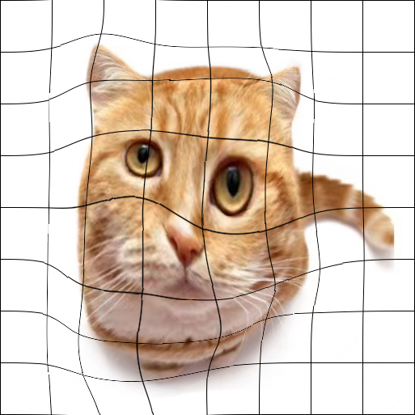

# Free-Form Deformation (FFD)
Follow this instruction to reproduce the result of my experiment.
Make sure this repo is under the directory ${MY_DIR}, 
and ensure you have installed libraries listed below in your running environment:

```
numpy==1.20.1
opencv-python=4.6.0.66
matplotlib==3.3.4
```

Now create a new terminal in an IDE (e.g. PyCharm, Visual Studio Code, etc.), activate the needed environment, and check if the current working directory is ${MY_DIR}. If not, change it to this directory.


Code files:

```transform.py``` is the main code file, which generate a transformed image according to given FFD. It includes functions of
coordinate generation and bilinear interpolation. The transformed image is stored to the same folder of
the original image.

```ffd.py``` defines the object 'FFD', which is the main functional module for FFD. The method 'FFDinvtransformation'
is used for compute the inverse FFD to be applied in interpolation.

``` add_grid.py ``` is an auxiliary module, which adds grid over an image. The grid points are the control points of FFD. 
You can visualize the deformation fields by transforming an image with grid.


To transform an image by FFD, run following command:

```
python transform.py -i ${IMAGE_DIR} -o ${OFFSET_DIR}
```

Change ```${IMAGE_DIR}``` to the directory of your input image.  The size of your input image is 513x513. Otherwise it will be resized to.
Change ```${OFFSET_DIR}``` to the directory of offset data.
The offset data of control points, as a 9x9x2 tensor, is stored in a text file. Its format is shown
in our report. You can either use our test data, which is stored in ./data, or define your own data
in terms of given format.

Example:

```
python transform.py -i images/meisje_met_de_parel.png -o data/trans1.txt
```

To add grid to an image, run following command:

```
python add_grid.py -i ${IMAGE_DIR}
```

Change ```${IMAGE_DIR}``` to the directory of your input image.
Please ensure the size of your input image is 513x513. Otherwise it will be resized to.
Example:

```
python add_grid.py -i images/cat.png
```

## Some Examples
 
 
