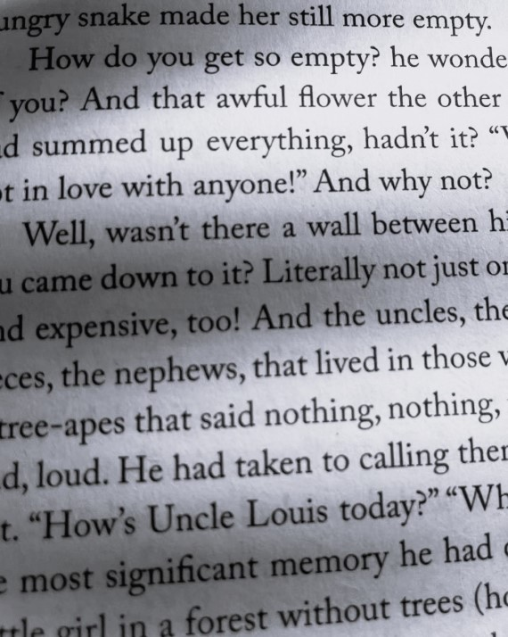
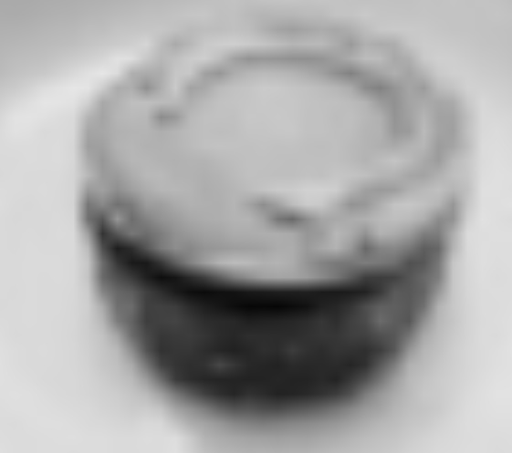

# Otsu Algorithm & Linear Interpolation

Follow this instruction to reproduce the result of my experiment. Make sure this repo is under the directory ${MY_DIR}, and ensure you have installed libraries listed below in your running environment:
```
numpy==1.20.1
opencv-python=4.6.0.66
matplotlib==3.3.4
```

Now create a new terminal in an IDE (e.g. PyCharm, Visual Studio Code, etc.),
and check if the current working directory is ${MY_DIR}. If not, change it to this directory.


## Otsu Thresholding Algorithm
To reproduce the adapt thresholding result, run this command:

```
python adapt_thresholding.py -i ${IMAGE_DIR} -s ${NEIGHBORHOOD_SIZE}
```

change the content of ```${...}```. For example:

```
python adapt_thresholding.py -i images/rimbaud.jpg -s 22
```

Some Examples are shown below:<br>

<p align="center">
   &nbsp;&nbsp;&nbsp;
   &nbsp;&nbsp;&nbsp;
</p>
<p align="center">
   &nbsp;&nbsp;&nbsp;
   &nbsp;&nbsp;&nbsp;
</p>


## Bilinear Interpolation

To reproduce the linear interpolation result, run this command:

```
python linear_interp.py -i ${IMAGE_DIR} -t ${TIMES_OF_MAGNIFICATION}
```

change the content of ```${...}```. For example:

```
python linear_interp.py -i images/hotel.jpg -t 8
```

Some examples are shown below:<br>

<p align="center">
   &nbsp;&nbsp;&nbsp;
   &nbsp;&nbsp;&nbsp;
</p>
<p align="center">
   &nbsp;&nbsp;&nbsp;
   &nbsp;&nbsp;&nbsp;
</p>


