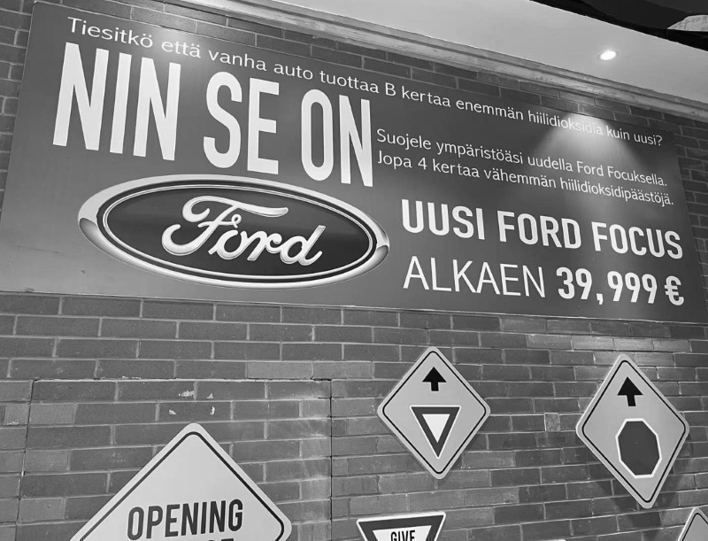
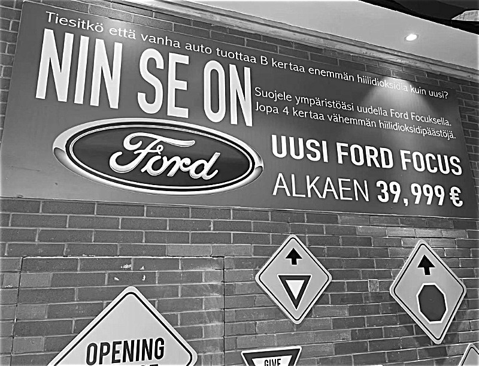
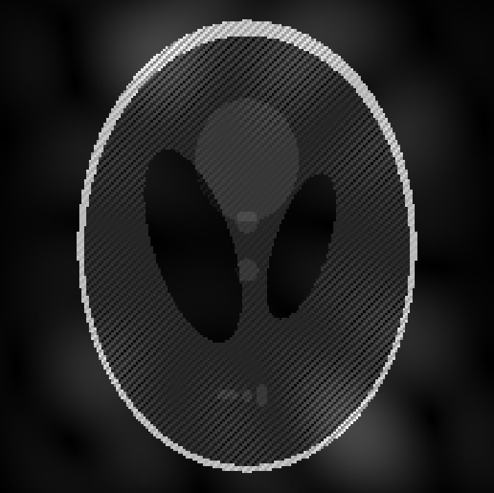

# Project 4: Frequency Filter
Follow this instruction to reproduce the result of my experiment. Make sure this repo is under the directory ```${MY_DIR}```, and ensure you have installed libraries listed below in your running environment:
```
numpy==1.20.1
opencv-python=4.6.0.66
matplotlib==3.3.4
```

Now create a new terminal in an IDE (e.g. PyCharm, Visual Studio Code, etc.),
activate the needed environment,
and check if the current working directory is ${MY_DIR}. If not, change it to this directory.


The file freq_filter.py includes the frequency filters needed in our experiments.

## Smoothing
To smooth an image, run this command:

```
python freq_smooth.py  [-i ${IMAGE_DIR} -d ${GAUSS_STD_DEVIATION} -r ${RADIUS_OF_IDEAL_FILTER}]
```

Change the content of ```${...}```, and content in brackets is optional. For example:

```
python freq_smooth.py -i images/suomi.jpg -d 100 -r 100
```

Example (Lowpass filter: original-ideal-Gaussian)

<p>
  
</p>

## Sharpening
To sharpen an image with Laplacian filter, run this command:

```
python freq_sharpen.py [-i ${IMAGE_DIR} -c ${WEIGHT_OF_LAPLACIAN_AND_GAUSSIAN_HIGHPASS} -d ${GAUSS_STD_DEVIATION}]
```

Change the content of ```${...}```, and content in brackets is optional. For example:

```
python freq_sharpen.py -i images/suomi.jpg -c 1 -d 100
```

Example (Highpass filter: original-Laplacian-Highboost)

<p>
  
</p>


## Periodic Noise Reduction
To reproduce the noise reduction result, run this command:

```
python noise_reduction.py
```

Example (Original-Denoised)
<p>
  
</p>
