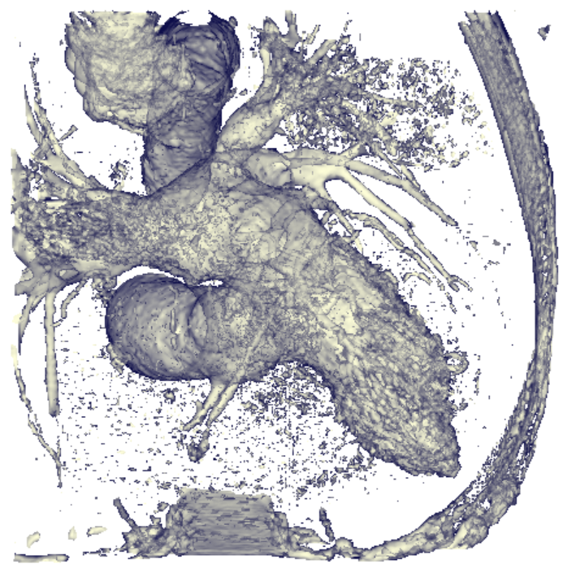
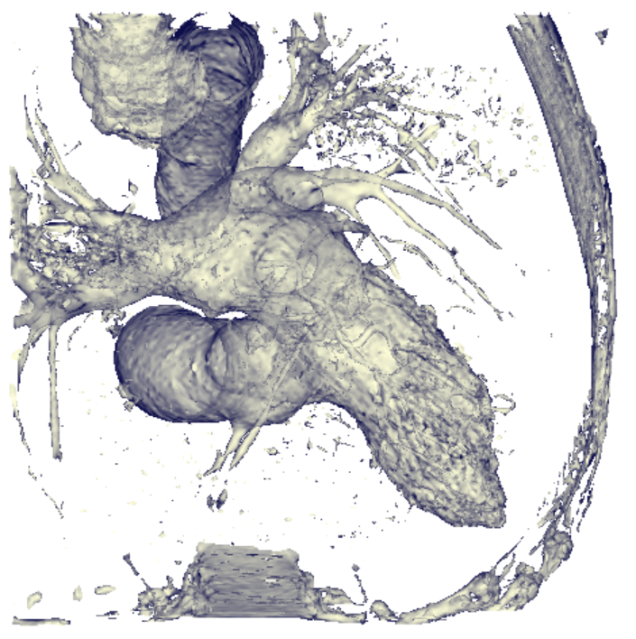

# Project 8: Isosurface Rendering
Follow this instruction to reproduce the result of my experiment. Make sure this repo is under the directory ${MY_DIR}, and ensure you have installed libraries listed below in your running environment:
```
nibabel==4.0.2
vtk==9.2.2
```

Now create a new terminal in an IDE (e.g. PyCharm, Visual Studio Code, etc.),
activate the needed environment,
and check if the current working directory is ${MY_DIR}. If not, change it to this directory.

Run this command in the terminal:
```
python iso_render.py
```
The first window shows the isosurface of data before smoothing. The second window shows the isosurface of data after smoothing. You can interact with the render result by click and drag the mouse over the window. 

The default value of isosurface is 150. If you want to see isosurfaces of different numerical values, modify line 83 of ```iso_render.py```.

Example: (iso = 150)
<p>
  &nbsp;&nbsp;&nbsp;&nbsp;
</p>
