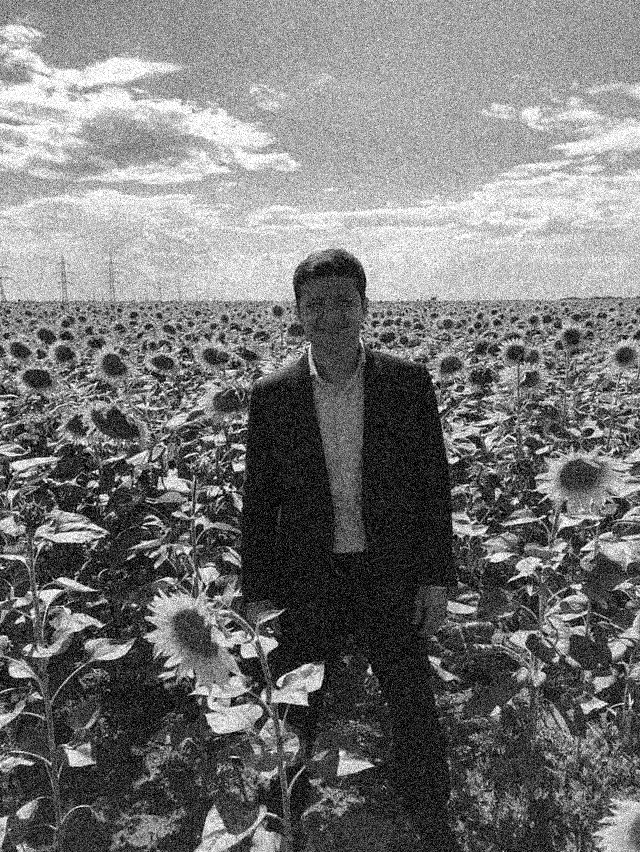
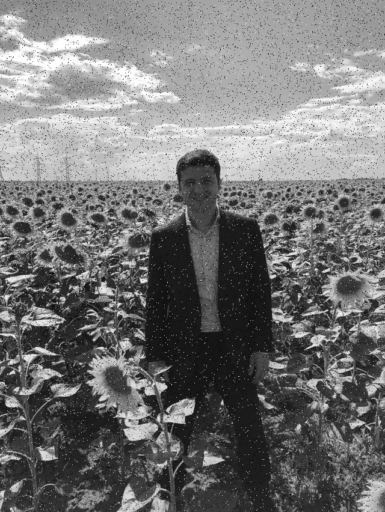
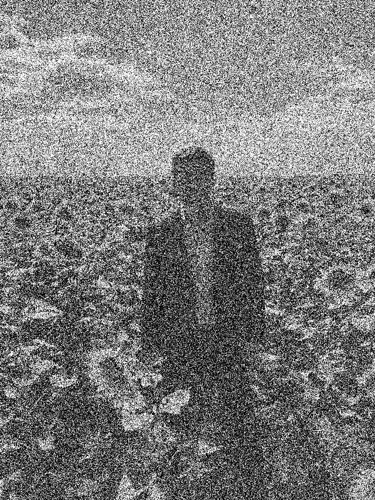

# Project 5: Noise Reduction
Follow this instruction to reproduce the result of my experiment. Make sure this repo is under the directory ```${MY_DIR}```, and ensure you have installed libraries listed below in your running environment:

```
numpy==1.20.1
opencv-python=4.6.0.66
matplotlib==3.3.4
```

Now create a new terminal in an IDE (e.g. PyCharm, Visual Studio Code, etc.),
activate the needed environment,
and check if the current working directory is ${MY_DIR}. If not, change it to this directory.

## Noise Generation
To add noise to an image, run this command:

```
python noise_gen.py  [-i ${IMAGE_DIR}]
```

Change the content of ```${...}```, and content in brackets is optional. For example:

```
python noise_gen.py -i images/zelenskyy.jpg
```

Example: Original - Gaussian Noise - Pepper-Salt Noise - Periodic Noise - White Noise (5 & 6)
<p>
  &nbsp;&nbsp;&nbsp;&nbsp;&nbsp;&nbsp;&nbsp;&nbsp;
</p>
<p>
  &nbsp;&nbsp;&nbsp;&nbsp;&nbsp;&nbsp;&nbsp;&nbsp;
</p>

## Optimum Notch Filter
To run the optimal notch filter, run this command:

```
python opt_notch.py [-i ${IMAGE_DIR}]
```

Change the content of ```${...}```, and content in brackets is optional. For example:

```
python opt_notch.py -i images/zelenskyy_interf.jpg
```

Example: Original - Vanilla Notch - Optimum Notch
<p>
  &nbsp;&nbsp;&nbsp;&nbsp;&nbsp;&nbsp;&nbsp;&nbsp;
</p>

Note that the parameters of notch pass filter need to be adjusted manually in line 99-100.
