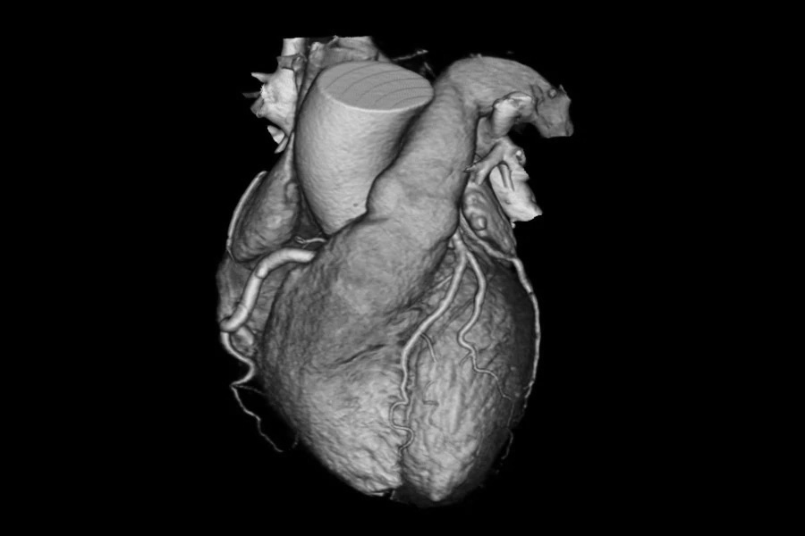
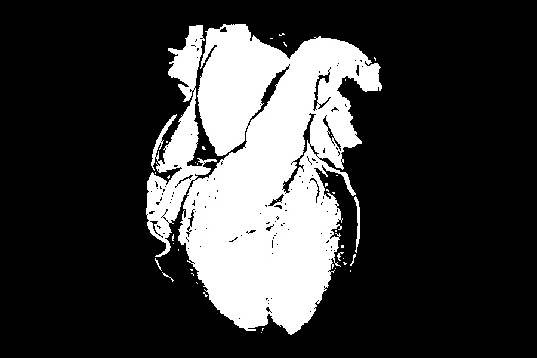
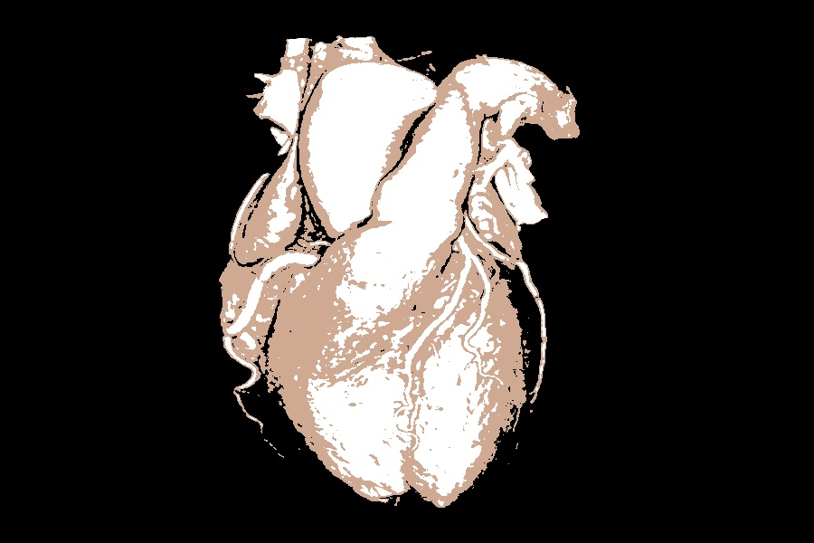
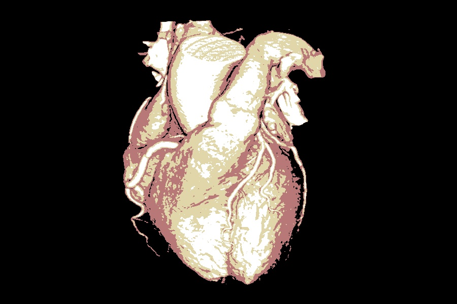
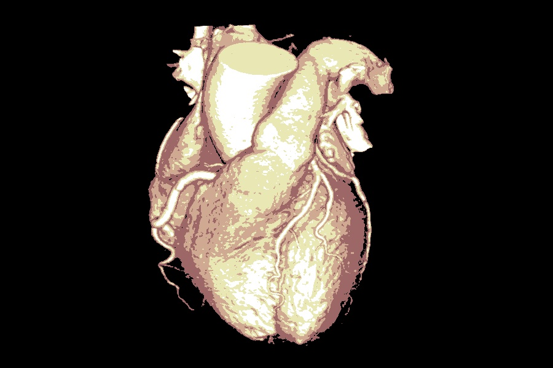
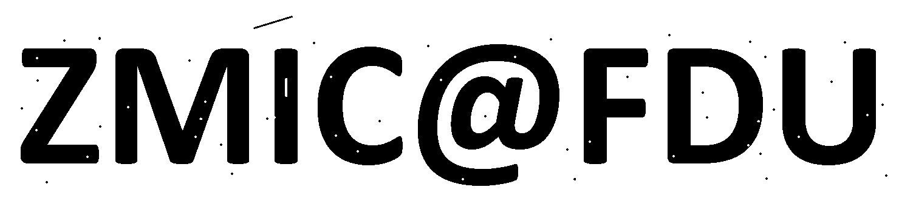

# Project 6: Segmentation and Morphological Operations
Follow this instruction to reproduce the result of my experiment. Make sure this repo is under the directory ```${MY_DIR}```, and ensure you have installed libraries listed below in your running environment:
```
numpy==1.20.1
opencv-python=4.6.0.66
matplotlib==3.3.4
```

Now create a new terminal in an IDE (e.g. PyCharm, Visual Studio Code, etc.), activate the needed environment, and check if the current working directory is ```${MY_DIR}```. If not, change it to this directory.

## k-means Segmentation
To segment an image by k-means algorithm, run this command:

```
python ./kmeans.py  [-i ${IMAGE_DIR}] [-k ${NUMBER_OF_CLASS}]
```

Change the content of ```${...}```, and content in brackets is optional. For example:

```
python ./kmeans.py -i ./images/heart.jpg -k 3
```

Note that the code also produces an thresholding result of Otsu algorithm.

Example (Original - Otsu - 2 clusters - 3 clusters -4 clusters - 5 clusters)

<p>
  &nbsp;&nbsp;&nbsp;&nbsp;&nbsp;&nbsp;&nbsp;&nbsp;
</p>
<p>
  &nbsp;&nbsp;&nbsp;&nbsp;&nbsp;&nbsp;&nbsp;&nbsp;
</p>

## Morphological Operations
To apply morphological operations on the image in my example, run this command:

```
python ./morph.py 
```

Example (Original - Restored)
<p>
  &nbsp;&nbsp;&nbsp;&nbsp;
</p>
